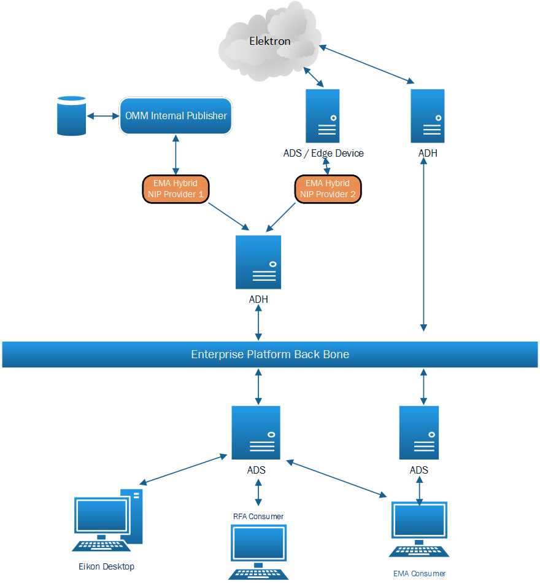
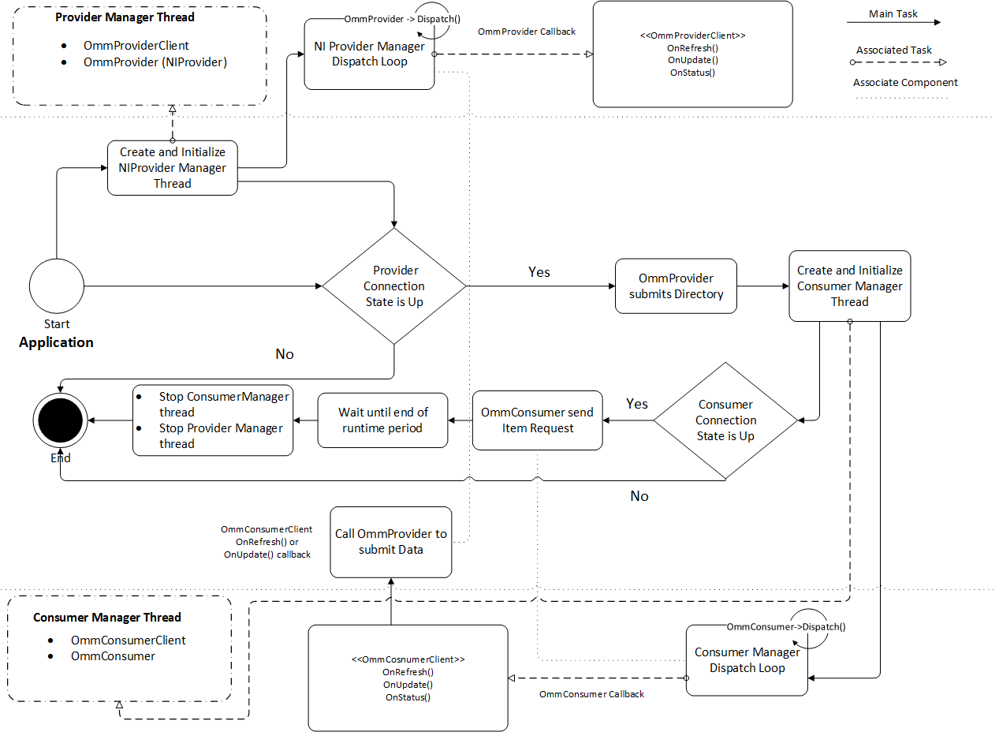

# How to create EMA Consumer and NI Provider Hybrid application using EMA C++

This example application is a C++ console application demonstrates how to use EMA C++ to develops Hybrid application for consuming data from provider server and re-publishing the data to ADH cache using NI Provider interface. Application uses both OMM Consumer and OMM Non-Interactive Provider in the same application. It also use multi-threading paradigm to create separate thread for Consumer and Provider so that both thread can run and dispatching data independently. User can use this example like a publisher tool to re-publish data to ADH Non Interactive service as well.

### Technical Prerequisites

The users should have a basic understanding of how to consume and publish data using EMA C++ which can be learnt from [EMA Consumer Tutorials](https://developers.thomsonreuters.com/elektron/elektron-sdk-cc/learning) in [Thomson Reuters Developer Community](https://developers.thomsonreuters.com) web site. Also they must have TREP infrastructure server which provide service for consuming data and Non-interactive service on ADH for using with the EMA Non-interactive publishing. If you are unsure about server and service, please contact Market Data team first, they should be able to provide information about the server and Non Interactive service for testing with this example.

## Overview

### OMM Non-Interactive Publisher

**OMM Non-Interactive Publisher** (OMM NIP) is one of solution for internal or local publishing system, it provides a feature which allows clients to publish OMM data through client socket connection without interacting with back-end infrastructure. The Publisher take responsible to decide what Market Data Items to publish and when to publish them. Basically OMM NIP application can establish a connection to an ADH server. Once connected, an OMM NIP can publish information into the ADH cache without needing to handle requests for the information. The ADH can cache the information and along with other Enterprise Platform components, provide the information to any OMM consumer applications that indicate interest.

Non-interactive publishing feature on ADH supports both a single publisher application service being published into a single server, as well as the aggregation of multiple publisher application services being published into a single server. Therefore user can leverage this ability to create aggregate service to provide aggregate data to internal consumer application.

### OMM Non-Interactive Hybrid application

OMM NIP Hybrid application fill a niche for applications that can both consume and provide data to internal consumer application. Hybrid application can consume data from a specific data feed or service and re-publishing the same data to ADH cache. The internal consumer application can consume the data from a new service created for the OMM NIP. While the data is passing through the hybrid, the contents of the messages can be decoded, changed, and re-encoded.  However this example use only passing though approach to publishing data to ADH cache.  Below diagram depicts how the EMA Hybrid application interact with Enterprise Platform.



ADH can configured to use aggregation of multiple publisher application. It depends on requirement. EMA Consumer or RFA Consumer can request the data from Non-Interactive aggregate service via ADS.

## Implementation
 
### Multi-Threading Paradigm

There are some concern about performance when using OmmConsumer and OmmProvider in the same application thread. This is because we are implementing Hybrid application which requires steps to call NI Provider to submit data to ADH every times it receives update from the consumer client callbacks.  In EMA, there is no internal queue where ticks are buffered. By default, OmmConsumerClient callback methods are executed in EMA thread of control which called API Dispatch mode. If the application delays in dispatching messages or there are some blocking when calling OmmProvider to submit data from the same application thread, it can result in slow consumer or unexpected dead lock behavior.

To avoid the issue we apply Horizontal Scaling implementation from EMA example (locates in Elektron Message API install package) 410__MarketPrice__HorizontalScaling to create separate threaded for running the OmmConsumer and OmmProvider. Application will set dispatch mode for each thread to User Dispatch mode instead of using API Dispatch. Then each thread will have its own dispatch loop for dispatching messages. 

### Application works flow



There are three main threads in demo application. Application main thread, Consumer Manager Thread and Provider Manager Thread. The application start from Application main thread and below steps are the description of the main work flows according to above diagram.
1.	Application creates and initialize NIProvider Manager Thread. It will create new thread for manage OmmProvider object and pass required parameters to create internal object and then send login to ADH immediately.NiProvider Manager Thread also has its own OmmProviderClient with the dispatch loop for dispatch message.

2.	After OmmProviderClient receive OnRefresh callback, Application has to check if the connection status is up or down. Basically EMA does not have callback for connection state. Therefore we assume that if the login stream is Open and Data state is Ok, that means connection is up and ready for publish data. If the connection state is down we will stop the NIProvider Manager thread and exit the application. 

3.	Application Thread use OmmProvider pointer from NIProvider manager to submit directory message to ADH. If user running adhmon or adsmon command on TREP server, they should see service state is up. 

4.	Application Thread create and initialize Consumer Manager Thread and pass required parameters and options from command line to OmmConsumer Manager. It send login request and then start new Thread for dispatch message immediately. Consumer Manager Thread holds pointer to OmmProviderClient and OmmProvider object inside so that it can call OmmProvider to submit message later.

5.	After connection state on Consumer side is up, Application Thread send item request using item name from command line argument one by one. It also generate Handle for the publisher side and add the handle to ITEMLIST data structure to use it later. User can run EMA consumer or RFA consumer to subscribe items from the service which just published by the hybrid app. But if the connection state is down, it will exit the application.

6.	Application Thread calls sleep to wait until the end of runtime period.

7.	The Consumer Manager receives callback via OmmConsumer Client. It has to process message it received from OnRefresh, OnUpdate and OnStatus callback.  Since the Consumer Manager Thread holds pointer to OmmProvider inside therefore it can use OmmProvider to submit data after receive Refresh or Update message. For the status message from OnStatus, callback, it just print message out to console.

8.	After the end of runtime period, Application thread stops Consumer and Provider manager Thread and then exit the application.

### How the application publish Directory service

There are two ways application can used to submit directory. 
The first one is to configured the service using EmaConfig.xml. There are section name DirectoryGroup which user can set service name and service with supports options for specific service. Below is sample configuration from the configuration file. API_NI_PUB is the service name we want to publish to ADH. 
```XML

<Directory>
  <Name value="Directory_1"/>		
	<Service>
		<Name value="API_NI_PUB"/>
		<InfoFilter>
			<ServiceId value="8500"/>				
			<Vendor value="company name"/>
			<IsSource value="0"/>
			<Capabilities>
				<CapabilitiesEntry value="MMT_MARKET_PRICE"/>
				<CapabilitiesEntry value="MMT_MARKET_BY_ORDER"/>
			</Capabilities>
			<DictionariesProvided>
				<DictionariesProvidedEntry value="Dictionary_1"/>
				<DictionariesProvidedEntry value="Dictionary_3"/>
			</DictionariesProvided>
				<DictionariesUsed>
				    <DictionariesUsedEntry value="Dictionary_1"/>
			    </DictionariesUsed>
			<QoS>
				<QoSEntry>
					<Timeliness value="Timeliness::RealTime"/>
					<Rate value="Rate::TickByTick"/>
					</QoSEntry>
			</QoS>
				
			<SupportsQoSRange value="0"/>
			<AcceptingConsumerStatus value="0"/>
			<SupportsOutOfBandSnapshots value="0"/>
		</InfoFilter>
		
		<StateFilter>
			<ServiceState value="1"/>
			<AcceptingRequests value="1"/>
			<Status>
				<StreamState value="StreamState::Open"/> 
				<DataState value="DataState::Ok"/>
				<StatusCode value="StatusCode::None"/>
				<StatusText value=""/>
			</Status>
		</StateFilter>
	</Service>
…
```
The last one is to use OmmProvider to submit directory message to ADH. Using this approach, user can specify service information via application configuration or command line arguments. In this example we provide command line options for user to setting service information. Do not use the same service name as configured in EmaConfig.xml. Otherwise EMA will throw InvalidUsage exception. Below is sample codes we use in the example.

```CPP
// Submit Directory to ADH with initial OpenLimit 50000
providerManager.getOmmNIProvider().submit(RefreshMsg().domainType(MMT_DIRECTORY).filter(SERVICE_INFO_FILTER | SERVICE_STATE_FILTER)
		.payload(Map()
		.addKeyUInt(defaultNIPubServiceID, MapEntry::AddEnum, FilterList()
		.add(SERVICE_INFO_ID, FilterEntry::SetEnum, ElementList()
		.addAscii(ENAME_NAME, defaultNIPubServiceName)
		.addAscii(ENAME_VENDOR, "Vender1")
		.addUInt(ENAME_IS_SOURCE, 1)
		.addArray(ENAME_CAPABILITIES,
                              OmmArray().addUInt(MMT_DICTIONARY).addUInt(MMT_MARKET_PRICE)
                              .addUInt(MMT_MARKET_BY_PRICE).complete())
		.addArray(ENAME_DICTIONARYS_USED, OmmArray().addAscii("RWFFld")
                              .addAscii("RWFEnum").complete())
		.addArray(ENAME_DICTIONARYS_PROVIDED, OmmArray().addAscii("RWFFld")
                              .addAscii("RWFEnum").complete())	 
                              .addArray(ENAME_QOS,OmmArray().addQos(OmmQosTimeliness::RealTimeEnum, 
                               OmmQos::Rate::TickByTickEnum).complete())
		.addUInt(ENAME_SUPPS_OOB_SNAPSHOTS,0)
		.addUInt(ENAME_ACCEPTING_CONS_STATUS, 0)
		.addUInt(ENAME_SUPPS_QOS_RANGE, 0).complete())
		.add(SERVICE_STATE_ID, FilterEntry::SetEnum, ElementList()
		.addUInt(ENAME_SVC_STATE, SERVICE_UP)
		.addUInt(ENAME_ACCEPTING_REQS,1)		  
                              .addState(ENAME_STATUS,OmmState::OpenEnum,OmmState::OkEnum,0,"OK")
		.complete())
		.add(SERVICE_LOAD_ID, FilterEntry::SetEnum, ElementList()
		.addUInt(ENAME_LOAD_FACT, 1)
		.addUInt(ENAME_OPEN_LIMIT, 50000)
		.complete()).complete())
		.complete()).complete(), defaultNISourceDirectoryHandle);
	.complete()).complete(), defaultNISourceDirectoryHandle);
```


### How the application detect EMA connection state

As described earlier that EMA does not have connection callback. Therefore the work around is to check login state instead and below is the codes application used to check the Login state. bConnectionUp is the flag to indicate that connection is up or down. The application use the same logics for both provider and consumer.
```CPP
if (refreshMsg.getDomainType() == MMT_LOGIN)
{			
         if (refreshMsg.getState().getStreamState() == OmmState::OpenEnum)
         {
	if (refreshMsg.getState().getDataState() == OmmState::OkEnum)
	              bConnectionUp = true;
	else
		bConnectionUp = false;
         }else
	bConnectionUp = false;		
}
```

### How the application re-publishes the data

After receiving Refresh or Update data, the application has to check if the message domain is MMT_MARKET_PRICE and then check if the connection on the NIProvider side is up and ready to publish data. 
Next step, it will get Item name from Refresh or Update message and use it to find the publisher handle from ITEMLIST data structure. Consumer Manager will call niProvider-> submit to publish data inside OnRefresh or OnUpdate callback.  For this steps it has to pass FieldList data from refreshMsg.getPayload().getFieldList() to publisher payload. 

Using this approach, application does not need to decode or iterate through FieldList object and it should take very small time inside OnRefresh or OnUpdate method to re-publish the data.
```CPP
if (refreshMsg.getDomainType() == MMT_MARKET_PRICE)
{
	if (niProviderClient->isConnectionUp())
	{ 
		ITEMLIST::iterator it;
		it = pItemList->find(refreshMsg.getName().c_str());
		if (it != pItemList->end())
		{
			string pubItemName = "";
			if (bUsePrefix)
				pubItemName = prefixString;

			pubItemName.append((*it).first);
			UInt64 pubHandle = (*it).second.NiPubHandle;
			RefreshMsg refresh;
			niProvider->submit(refresh.clear().serviceName(defaultNIPubServiceName)
            .name(pubItemName.c_str()).domainType(MMT_MARKET_PRICE)
			.state(OmmState::OpenEnum, OmmState::OkEnum,                    
                                             OmmState::NoneEnum, "UnSolicited Refresh Completed").complete(true)
			.payload(refreshMsg.getPayload().getFieldList()), pubHandle);
		}
	}

}
```
## Running Hybrid demo application

### How to compile and build the example

Download example [OMMNIPHybridAppExample](https://github.com/TR-API-Samples/Example.EMA.Cpp.NIProviderHybridApp) from Github. The example has been created and tested with Visual Studio 2013 and it uses Electron  SDK version 1.1.0 to build the application. We also provide make file for building the example on Linux as well.
 
To build the example user has to set below environment variable before open project with Visual Studio or building the example on Linux.

**Windows** 

Set environment variable name **EMAInstall** to EMA installation path.

>Eg. _set EMAInstall="C:\Projects\API\EMA"_

**Linux**

Open makefile and change **ROOTPLAT** variable to EMA Installation path.

>Eg. _ROOTPLAT="/home/Projects/API/EMA"_

After building the application, it will generate _emahybridapp.exe_ on windows platform or _emahybridapp_ on Linux. The build script will copy _EmaConfig.xml_ along with required files to output directory.

### How to run the example

The Hybrid demo application provides the following options for user:
* Request one or multiple items from ADS or Provider server and re-publish the data to ADH.
User can specify item list in command line argument or set command line option to load item list from file.
*	Example provides option for user to enable OMM view and pass FID list in command line arguments.
*	Example provides options for rename item when application re-publish the data. It has command line options to set item prefix string.
*	Example supports EMA configuration file EmaConfig.xml and user has to set server information along with Non Interactive service name they want to publish in the configuration file. It can also turn on trace message using the configuration file. Please find more information about Ema Configuration from Ema C++ Configuration Guide.

User has to set hostname and RSSL port for Consumer and NIProvider side in EmaConfig.xml.

Default channel for OmmConsumer is Channel_1. User has to change Host and Port from the following section.
```
<Name value="Channel_1"/>
			<ChannelType value="ChannelType::RSSL_SOCKET"/>
			<CompressionType value="CompressionType::None"/>
			<GuaranteedOutputBuffers value="5000"/>

			<ConnectionPingTimeout value="30000"/>
			
			<!-- TcpNodelay is optional: defaulted to 1 												-->
			<!-- possible values: 1 (tcp_nodelay option set), 0 (tcp_nodelay not set)					-->
			<TcpNodelay value="1"/>
			<Host value="<Subscriber Hostname/IP Address>"/>
			<Port value="<RSSL Port>"/>
		</Channel>
```
Default channel for NIProvider is Channel_10. User has to change Host and Port from the following section.

```	
		<Channel>
			<Name value="Channel_10"/>
			<ChannelType value="ChannelType::RSSL_SOCKET"/>
			<GuaranteedOutputBuffers value="5000"/>
			<ConnectionPingTimeout value="30000"/>
			<TcpNodelay value="1"/>
			<Host value="<ADH Hostname/IP Address>"/>
			<Port value="<RSSL Port for Non interactive provider>"/>
		</Channel>
		
```
Using -? command line argument, it will shows help page describing command line options.

>_emahybridapp.exe -?_  or _./emahybridapp -?_

It will displays the following instruction

```
EMA Consumer Non Interactive Provider Hybrid demo
The following options are supported

 -s        Followed by the subscribing service name 
 -nip      Followed by the non-interactive publishing service name
 -mp        Followed by a list of Market Price item names separated by space. Required by consumer and non-iteractive client publish

 -itemfile Followed absolute file path to file contains item list
           Note: command line options can contains either -mp or -filename. If it contains both options it will use item list from last one

 Optional options

 -v        Followed by a list of FID id (integer) seperated by space. Turn on OMM view request options 

 -nipuser  Followed by Username for Non interactive provider, default is username
 -u        Followed by Username for Consumer side, default is username.
 -pos      Followed by Position, default is 127.0.0.1/net
 -instance Followed by NI Provier Login instance ID, default is 1.
 -svcid    Followed by Service ID for Non Interactive publishing service, default is 8500
 -appid	 Followed by Application ID, default is 256
 -d        Dump OMM Refresh and Update message to console output
 -runtime  Followed by Application runtime period in second, default is 600 second

 -prefix   Followed by prefix string. It's used to rename publish item name.
           For example, 
              use -mp TRI.N -prefix TEST_ 
           The demo application will re-publish data using item name TEST_TRI.N instead
           Consumer application has to subscribe data using the new item name

Usage:
	emahybridapp -s DIRECT_FEED -nip NIPUB -u username -mp TRI.N GOOG.O
	or
	emahybridapp -s DIRECT_FEED -nip NIPUB -u username -itemfile ./itemlist.txt
	creates a service called NIPUB which derives all its items from DIRECT_FEED

	emahybridapp.exe -s DIRECT_FEED -nip NIPUB -u username -mp TRI.N -runtime 3600
	For running the application 3600 second and then exit

	emahybridapp -s DIRECT_FEED -nip NIPUB -u username -mp TRI.N -v 2 3 6 11 12 13 15 16 17 18 19 21 22 25 30 31
	To request item TRI.N with OMM view option, the application will publish only requested FID to ADH cache.

The Demo application works in pass through mode.
It will re-publish the data as is based on the data from item list user provided

```

Basically user must have the following parameter in command line argument list. Otherwise, it will display help page instead.

```
>./emahybridapp -s <Service for Consumer> -nip <Service for Provider> -mp <Item1> <Item2> <Item3>…
```

Or

```
./emahybridapp -s <Service for Consumer> -nip <Service for Provider> -filename ./itemlist.txt
```

### Sample Console output

User can use view option by using -v followed by FID list. Below is the console output when using with OMM view.

>./_emahybridapp_ -s __API_ELEKTRON_EDGE_TOKYO__ -nip __API_ADH_NI_PUB__ -mp __EUR= GBP= THB=__ -v __3 19 21 22 25 57 59__

```
NIProvier OnRereshMsg Handle: 46468864 Closure: 0x6bb8a2
NIProvider server connecting to ADH...
NIProvder ready to publish data...
Publish Directory to ADH...
Consumer connecting to Provider server...
loggerMsg
    TimeStamp: 16:30:38.008
    ClientName: ChannelCallbackClient
    Severity: Success
    Text:    Received ChannelUp event on channel Channel_1
	Instance Name Consumer_1_2
	Connected component version: ads2.6.0.L1.solaris.rrg 64-bit
loggerMsgEnd


Login OnRereshMsg Handle: 46826816 Closure: ConsumerClient
Consumer login accepted...
Start requesting data from Provider server...
Add EUR= to item list
	Send Item with View Request for item EUR=
Add GBP= to item list
	Send Item with View Request for item GBP=
Add THB= to item list
	Send Item with View Request for item THB=

Market Price OnRereshMsg Handle: 46528960 ItemName EUR=
Publish Refresh message for Item EUR= to Non Interactive provider service...

Market Price OnRefreshMsg Handle: 46422608 ItemName GBP=
Publish Refresh message for Item GBP= to Non Interactive provider service...

Market Price OnRefreshMsg Handle: 46592016 ItemName THB=
Publish Refresh message for Item THB= to Non Interactive provider service...

Market Price OnUpdateMsg Handle: 46528960 ItemName: EUR=
Publish Update message for Item EUR= to Non Interactive provider service...

Market Price OnUpdateMsg Handle: 46422608 ItemName: GBP=
Publish Update message for Item GBP= to Non Interactive provider service...
```

And below is sample console output from RFA StarterConsumer example we used to verify data from the Non Interactive service. The data it received contains only FIDs we specified in view options on the publisher side.

```
2017/08/17 16:30:47.737 TRACE <- Received MMT_LOGIN Status - Login Accepted
    streamState : Open
    dataState   : Ok
    statusCode  : None
    statusText  : Login accepted by host lithium.
2017/08/17 16:30:47.992 TRACE <- Received MMT_MARKET_PRICE Refresh THB=
    serviceName : API_ADH_NI_PUB
    symbolName  : THB=
    streamState : Open
    dataState   : Ok
    statusCode  : None
    statusText  : UnSolicited Refresh Completed
    FieldList : standard data count = 7
        FieldEntry [     3] DSPLY_NAME        	"BROKER       GFX"
        FieldEntry [    19] OPEN_PRC          	33.26
        FieldEntry [    21] HST_CLOSE         	33.25
        FieldEntry [    22] BID               	33.25
        FieldEntry [    25] ASK               	33.27
        FieldEntry [    57] OPEN_BID          	33.26
        FieldEntry [    59] OPEN_ASK          	33.28
2017/08/17 16:30:48.043 TRACE <- Received MMT_MARKET_PRICE Refresh GBP=
    serviceName : API_ADH_NI_PUB
    symbolName  : GBP=
    streamState : Open
    dataState   : Ok
    statusCode  : None
    statusText  : UnSolicited Refresh Completed
    FieldList : standard data count = 7
        FieldEntry [     3] DSPLY_NAME        	"SOC GEN      SOF"
        FieldEntry [    19] OPEN_PRC          	1.2889
        FieldEntry [    21] HST_CLOSE         	1.2888
        FieldEntry [    22] BID               	1.2883
        FieldEntry [    25] ASK               	1.2885
        FieldEntry [    57] OPEN_BID          	1.2889
        FieldEntry [    59] OPEN_ASK          	1.2893
2017/08/17 16:30:48.192 TRACE <- Received MMT_MARKET_PRICE Refresh EUR=
    serviceName : API_ADH_NI_PUB
    symbolName  : EUR=
    streamState : Open
    dataState   : Ok
    statusCode  : None
    statusText  : UnSolicited Refresh Completed
    FieldList : standard data count = 7
        FieldEntry [     3] DSPLY_NAME        	"EMIRATES NBD DXB"
        FieldEntry [    19] OPEN_PRC          	1.1766
        FieldEntry [    21] HST_CLOSE         	1.1768
        FieldEntry [    22] BID               	1.1724
        FieldEntry [    25] ASK               	1.1727
        FieldEntry [    57] OPEN_BID          	1.1766
        FieldEntry [    59] OPEN_ASK          	1.1768
2017/08/17 16:30:48.213 TRACE <- Received MMT_MARKET_PRICE Update GBP=
    FieldList : standard data count = 3
        FieldEntry [    22] BID               	1.2883
        FieldEntry [    25] ASK               	1.2884
        FieldEntry [     3] DSPLY_NAME        	"EMIRATES NBD DXB"
2017/08/17 16:30:48.452 TRACE <- Received MMT_MARKET_PRICE Update GBP=
    FieldList : standard data count = 3
        FieldEntry [    22] BID               	1.2882
        FieldEntry [    25] ASK               	1.2885
        FieldEntry [     3] DSPLY_NAME        	"INTERPROMBAN MOW"
…
```

## References

* Examples Consumer and NIProvider in the Elektron SDK – C/C++ (EMA) package. The package is available at the [developer community](https://developers.thomsonreuters.com/elektron/elektron-sdk-cc/downloads).

* Advanced Data Hub 3.0 : Software Installation Manual in ADH 3.0 package. You can download it from the [Software Download](). It is in Category: MDS – Infra and Products: Advanced Data Hub (ADH)

Download Link [GitHub](https://github.com/TR-API-Samples/Example.EMA.Cpp.NIProviderHybridApp)